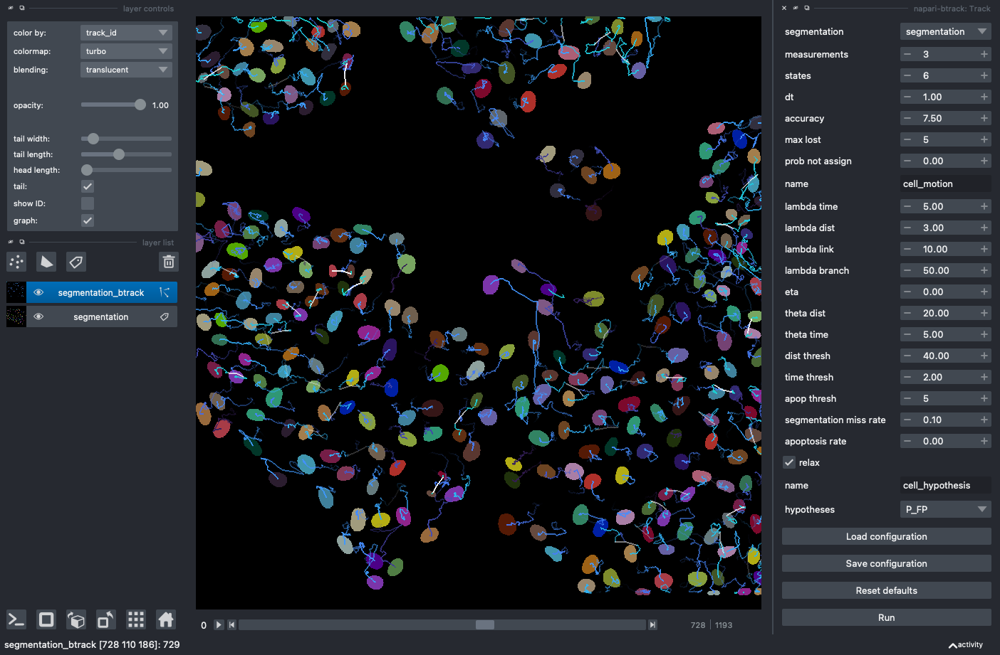

[](https://pypi.org/project/btrack)  [](https://pepy.tech/project/btrack)
[](https://github.com/psf/black)
[](https://github.com/quantumjot/BayesianTracker/actions/workflows/test.yml)
[](https://github.com/pre-commit/pre-commit)
[](https://btrack.readthedocs.io/en/latest/?badge=latest)
[](https://codecov.io/gh/quantumjot/BayesianTracker)


# btrack :microscope::computer:

BayesianTracker (`btrack`) is a Python library for multi object tracking, used to reconstruct trajectories in crowded fields. We developed `btrack` for cell tracking in time-lapse microscopy data.




## napari plugins

``btrack`` comes with a number of optional napari plugins. To install the
dependencies needed to use these plugins, install the ``napari`` extra via:

```sh
pip install btrack[napari]
```


## related plugins

We have also developed a napari plugin, arboretrum, that can be used to visualise track properties and lineage trees:

[](https://napari-hub.org/plugins/napari-arboretum)


## how to cite

**Automated deep lineage tree analysis using a Bayesian single cell tracking approach**
Ulicna K, Vallardi G, Charras G and Lowe AR.
*Front in Comp Sci* (2021)
[](https://doi.org/10.3389/fcomp.2021.734559)

```bibtex
@ARTICLE {10.3389/fcomp.2021.734559,
   AUTHOR = {Ulicna, Kristina and Vallardi, Giulia and Charras, Guillaume and Lowe, Alan R.},
   TITLE = {Automated Deep Lineage Tree Analysis Using a Bayesian Single Cell Tracking Approach},
   JOURNAL = {Frontiers in Computer Science},
   VOLUME = {3},
   PAGES = {92},
   YEAR = {2021},
   URL = {https://www.frontiersin.org/article/10.3389/fcomp.2021.734559},
   DOI = {10.3389/fcomp.2021.734559},
   ISSN = {2624-9898}
}
```

<!--
## Description

This should be a detailed description of the context of your plugin and its
intended purpose.

If you have videos or screenshots of your plugin in action, you should include them
here as well, to make them front and center for new users.

You should use absolute links to these assets, so that we can easily display them
on the hub. The easiest way to include a video is to use a GIF, for example hosted
on imgur. You can then reference this GIF as an image.


Note that GIFs larger than 5MB won't be rendered by GitHub - we will however,
render them on the napari hub.

The other alternative, if you prefer to keep a video, is to use GitHub's video
embedding feature.

1. Push your `DESCRIPTION.md` to GitHub on your repository (this can also be done
as part of a Pull Request)
2. Edit `.napari/DESCRIPTION.md` **on GitHub**.
3. Drag and drop your video into its desired location. It will be uploaded and
hosted on GitHub for you, but will not be placed in your repository.
4. We will take the resolved link to the video and render it on the hub.

Here is an example of an mp4 video embedded this way.

https://user-images.githubusercontent.com/17995243/120088305-6c093380-c132-11eb-822d-620e81eb5f0e.mp4


## Intended Audience & Supported Data

This section should describe the target audience for this plugin (any knowledge,
skills and experience required), as well as a description of the types of data
supported by this plugin.

Try to make the data description as explicit as possible, so that users know the
format your plugin expects. This applies both to reader plugins reading file formats
and to function/dock widget plugins accepting layers and/or layer data.
For example, if you know your plugin only works with 3D integer data in "tyx" order,
make sure to mention this.

If you know of researchers, groups or labs using your plugin, or if it has been cited
anywhere, feel free to also include this information here.

## Quickstart

This section should go through step-by-step examples of how your plugin should be used.
Where your plugin provides multiple dock widgets or functions, you should split these
out into separate subsections for easy browsing. Include screenshots and videos
wherever possible to elucidate your descriptions.

Ideally, this section should start with minimal examples for those who just want a
quick overview of the plugin's functionality, but you should definitely link out to
more complex and in-depth tutorials highlighting any intricacies of your plugin, and
more detailed documentation if you have it.

<!--## Additional Install Steps (uncommon)
We will be providing installation instructions on the hub, which will be sufficient
for the majority of plugins. They will include instructions to pip install, and
to install via napari itself.

Most plugins can be installed out-of-the-box by just specifying the package requirements
over in `setup.cfg`. However, if your plugin has any more complex dependencies, or
requires any additional preparation before (or after) installation, you should add
this information here.

## Getting Help

This section should point users to your preferred support tools, whether this be raising
an issue on GitHub, asking a question on image.sc, or using some other method of contact.
If you distinguish between usage support and bug/feature support, you should state that
here.

## How to Cite

Many plugins may be used in the course of published (or publishable) research, as well as
during conference talks and other public facing events. If you'd like to be cited in
a particular format, or have a DOI you'd like used, you should provide that information here.
-->
